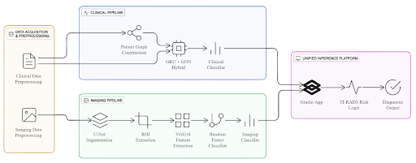

# ThyroTrack
## ⚠️ Branch Notice

Please note that the **most up-to-date and stable version of this project is located in the `master` branch**, not the default `main` branch.

To switch to the correct branch, use:
```bash
git checkout master
```

ThyroTrack is a multimodal clinical AI system for thyroid nodule risk stratification that integrates ultrasound imaging, longitudinal clinical data, and patient similarity modeling. The platform combines CNN-based image feature extraction, GRU-based temporal hormone modeling, and GNN-based relational learning to move beyond static binary diagnosis and provide interpretable, individualized risk assessment aimed at reducing overdiagnosis and unnecessary thyroid surgery.

## 📊 Project Visualizations

A complete overview of the motivation, methodology, architecture, and results of **ThyroTrack** is available here:

🔗 [View Presentation Slides (PDF)](ThyroTrack_Presentation.pdf)
🔗 [View Poster (PDF)](ThyroTrack_Poster.pdf)


